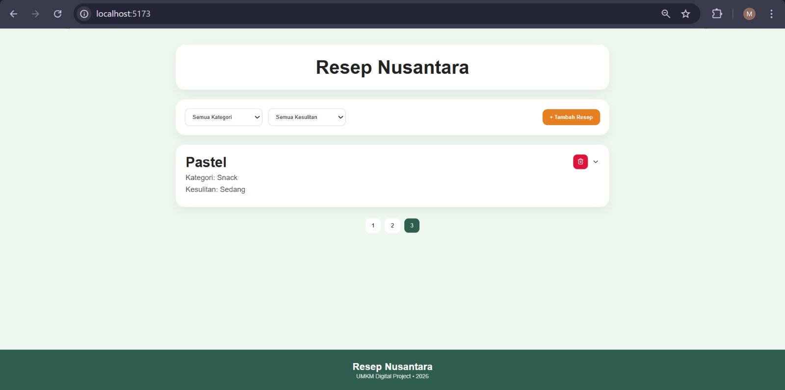
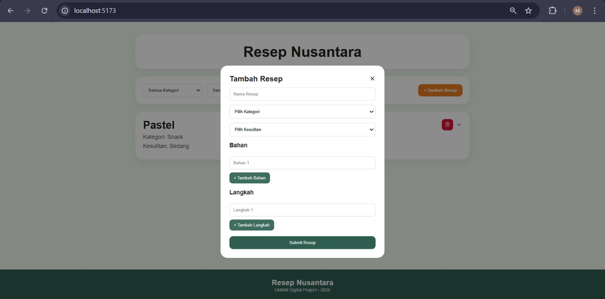
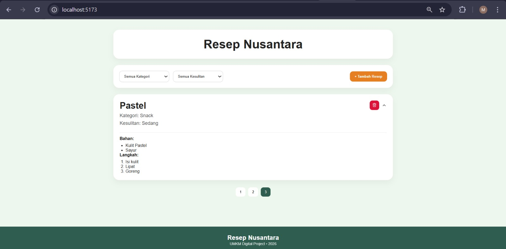

# Resep Nusantara Web - UTS Pemrograman Web Lanjut

## Informasi Mahasiswa

- **Nama:** Muhammad Prayogo Pangestu
- **Nim:** 2410501046
- **Program Studi:** D3 Sistem Informasi

## Deskripsi App / Web

Resep Nusantara Web adalah aplikasi web fullstack yang dibuat untuk menampilkan daftar resep masakan tradisional Indonesia sebagai bentuk dukungan digitalisasi UMKM kuliner Indonesia.

Aplikasi ini memungkinkan pengguna untuk:

- Melihat daftar resep makanan nusantara
- Melihat detail bahan dan langkah memasak menggunakan accordion
- Menambahkan resep baru melalui modal form
- Menambahkan lebih dari satu bahan dan langkah secara dinamis
- Filter resep berdasarkan kategori dan tingkat kesulitan
- Pagination daftar resep
- Menghapus resep
- Tampilan responsive untuk desktop maupun mobile

## Tech Stack

### Frontend

- React.js
- Vite
- CSS
- Axios
- Lucide React

### Backend

- Node.js
- Express.js

### Database

- MySQL

### Tools

- XAMPP
- Git
- GitHub
- Thunder Client

## Screenshoot

### Home Page



### Modal Tambah Resep



### Detail Accordion



## Cara Menjalankan

### 1. Clone Repository

```bash
git clone https://github.com/Suikayz-cmyk/resep-nusantara-web
```

### 2. Masuk Folder Project

```bash
cd resep-nusantara-web
```

### 3. Setup Database

- Jalankan XAMPP
- Aktifkan Apache dan MySQL
- Buka phpMyAdmin
- Buat database baru:

```sql
resep_nusantara
```

- Import file SQL jika tersedia

### 4. Jalankan Backend

```bash
cd backend
npm install
npm start
```

Backend berjalan di:

```text
http://localhost:5000
```

### 5. Jalankan Frontend

```bash
cd frontend
npm install
npm run dev
```

Frontend berjalan di:

```text
http://localhost:5173
```

## Fitur Utama

- CRUD Resep (Create, Read, Delete)
- Dynamic Form Field
- Accordion Detail Resep
- Filter Kategori & Kesulitan
- Pagination
- Responsive Design
- REST API Integration
